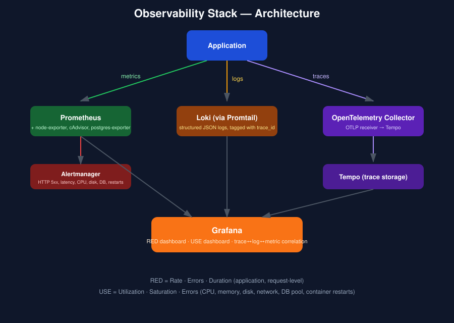
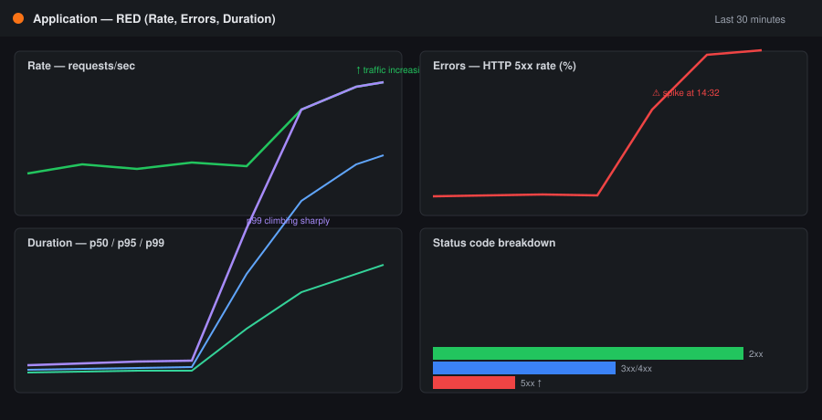
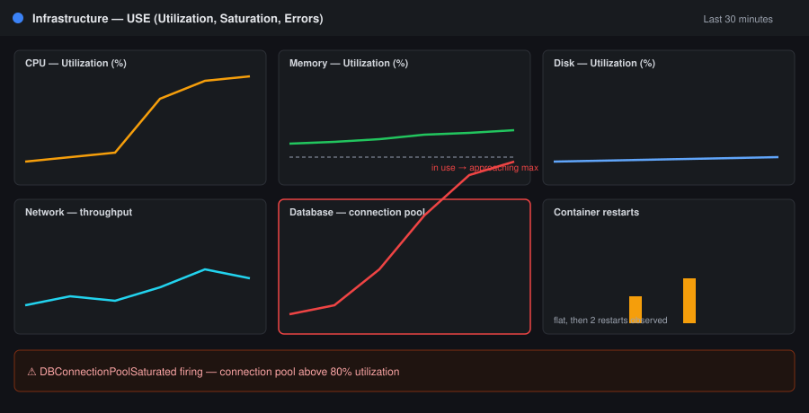
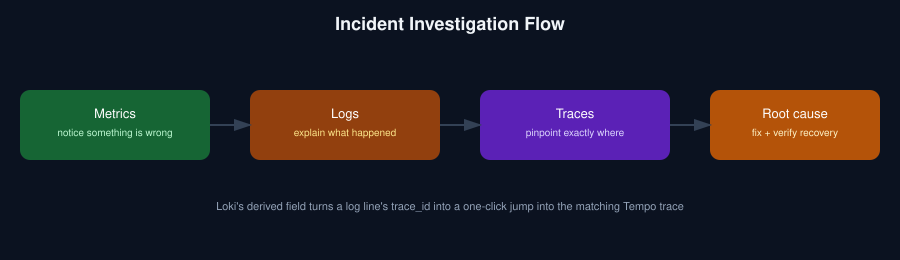

# Plataforma de Observabilidade de Verdade

[](.github/workflows/app-ci.yml)
[](LICENSE)
[](observability/prometheus)
[](observability/grafana)
[](app/src/telemetry)

[](README.md)

Isso é um serviço instrumentado de verdade, conectado a uma stack completa de observabilidade — métricas, logs e traces, correlacionados entre si — mais **falhas reais e reproduzíveis que você pode disparar sob demanda**, com um runbook que guia a detecção e investigação de cada uma, de ponta a ponta.

## O que este projeto prova

Um dashboard RED funcional para a aplicação, um dashboard USE funcional para a infraestrutura, regras de alerta que realmente disparam, e um fluxo de investigação documentado que vai de um pico no dashboard até a causa raiz exata, usando logs e traces distribuídos.

## Arquitetura



```
Application
    |
    +---- Metrics ----> Prometheus
    |
    +---- Logs -------> Loki (via Promtail)
    |
    +---- Traces ------> OpenTelemetry Collector ---> Tempo
                              |
                           Grafana
```

| Sinal | Ferramenta | Para que serve |
|---|---|---|
| Métricas | Prometheus + Alertmanager | séries temporais RED/USE, regras de alerta |
| Logs | Loki + Promtail | logs estruturados em JSON, correlacionados por `trace_id` |
| Traces | OpenTelemetry SDK/Collector + Tempo | linha do tempo distribuída de cada requisição |
| Visualização | Grafana | dashboards + correlação trace ↔ log ↔ métrica com um clique |
| Métricas de host/infra | node-exporter, cAdvisor, postgres-exporter | CPU, memória, disco, rede, conexões de banco, restarts de container |

## Dashboards

### RED — para a aplicação (golden signals no nível de requisição)



- **Rate** — requisições/seg, geral e por rota
- **Errors** — taxa de HTTP 5xx (%), detalhamento por status code
- **Duration** — latência p50 / p95 / p99

### USE — para infraestrutura e dependências



- **Utilization** — CPU %, memória %, disco %, throughput de rede
- **Saturation** — load average, uso de swap, tempo de I/O em disco, pool de conexões do banco (em uso vs. máximo)
- **Errors** — OOM kills, ciclos de CPU limitados (throttled), restarts de container, HTTP 5xx

## Detecte de verdade, não só olhe

A aplicação vem com endpoints `/chaos/*` que disparam falhas reais — não são prints de um sistema saudável. Gere uma carga base de tráfego, quebre algo de propósito, e depois encontre o problema:

```bash
docker compose up -d --build
./scripts/generate-traffic.sh          # carga base
./scripts/inject-fault.sh latency 2500 # ou: errors 0.5 / db-exhaust 9
```



O passo a passo completo dos três cenários — pico de latência, pico de 5xx e saturação do pool de conexões — incluindo exatamente qual painel se move, qual alerta dispara e como rastrear até a causa raiz usando logs e spans do Tempo, está no **[Runbook de Investigação de Incidente](runbooks/incident-investigation.pt-br.md)**.

## O que é monitorado

| Categoria | Exemplos |
|---|---|
| Aplicação (RED) | taxa de requisições, taxa de HTTP 5xx, latência p50/p95/p99, throughput, requisições em andamento |
| Computação | utilização e saturação de CPU (load average), utilização de memória e swap |
| Armazenamento | utilização de disco, saturação de I/O em disco |
| Rede | throughput de entrada/saída |
| Banco de dados | utilização/saturação do pool de conexões, duração de queries |
| Confiabilidade | restarts de container/pod, OOM kills, CPU throttling |

## Estrutura do repositório

```
observability-platform/
├── app/                          # serviço Node.js instrumentado
│   ├── src/telemetry/            # tracing OpenTelemetry + métricas Prometheus
│   ├── src/routes/chaos.js       # endpoints de injeção de falha
│   └── Dockerfile
├── observability/
│   ├── prometheus/                # prometheus.yml + alerts.yml
│   ├── alertmanager/
│   ├── loki/ & promtail/
│   ├── otel-collector/ & tempo/
│   └── grafana/
│       ├── provisioning/           # datasources com correlação trace<->log<->métrica
│       └── dashboards/             # red-dashboard.json, use-dashboard.json
├── runbooks/                     # incident-investigation.md (EN) + .pt-br.md
├── scripts/                      # generate-traffic.sh, inject-fault.sh, reset-chaos.sh
├── docs/images/                  # diagramas de arquitetura e dos dashboards
└── docker-compose.yml
```

## Tecnologias utilizadas

- **Prometheus** + **Alertmanager** (métricas e alertas)
- **Grafana** (dashboards, fontes de dados correlacionadas)
- **Loki** + **Promtail** (agregação de logs)
- **OpenTelemetry** (SDK Node.js com auto-instrumentação + Collector) + **Tempo** (armazenamento de traces)
- **node-exporter**, **cAdvisor**, **postgres-exporter** (métricas de infraestrutura)
- **Node.js 20 / Express / prom-client / pino** para o serviço de exemplo
- **Docker Compose** para rodar toda a stack localmente
- **GitHub Actions** para CI (lint + testes)

## Como começar

### Pré-requisitos
- [Docker](https://docs.docker.com/get-docker/) e Docker Compose
- `curl` (usado pelos scripts auxiliares)

### 1. Suba tudo

```bash
git clone https://github.com/seu-usuario/observability-platform.git
cd observability-platform

cp app/.env.example app/.env
docker compose up -d --build
```

### 2. Abra as ferramentas

| Ferramenta | URL | Credenciais |
|---|---|---|
| Aplicação | http://localhost:3000 | — |
| Grafana | http://localhost:3001 | admin / admin |
| Prometheus | http://localhost:9090 | — |
| Alertmanager | http://localhost:9093 | — |
| Tempo (via Grafana Explore) | — | — |

### 3. Gere tráfego e quebre algo de propósito

```bash
./scripts/generate-traffic.sh
./scripts/inject-fault.sh errors 0.5
./scripts/reset-chaos.sh
```

Depois siga o [runbook](runbooks/incident-investigation.pt-br.md) para investigar usando os dashboards, o Loki e o Tempo.

## Variáveis de ambiente

Documentadas em `app/.env.example`:

| Variável | Descrição |
|---|---|
| `PORT`, `SERVICE_NAME` | porta em que a aplicação escuta e nome (usado em logs/traces) |
| `DB_HOST`, `DB_PORT`, `DB_NAME`, `DB_USER`, `DB_PASSWORD`, `DB_POOL_MAX` | conexão com o PostgreSQL e tamanho do pool |
| `OTEL_EXPORTER_OTLP_ENDPOINT`, `OTEL_SERVICE_NAME` | para onde os traces são enviados |
| `LOG_LEVEL` | verbosidade dos logs (pino) |

**Nunca faça commit de arquivos `.env`** — apenas os templates `.env.example` são versionados.

## Testes e qualidade de código

```bash
cd app && npm install && npm run lint && npm test
```

- ESLint e o test runner nativo do Node rodam em todo PR que altera `app/**` (veja `.github/workflows/app-ci.yml`).
- Nenhum segredo, token ou credencial é commitado.

## Como contribuir

1. Faça um fork do repositório e crie uma branch a partir de `main`.
2. Faça sua alteração; rode os testes da aplicação localmente.
3. Abra um Pull Request — a CI roda lint + testes automaticamente.
4. Se adicionar uma métrica ou painel novo, atualize o JSON do dashboard correspondente e o runbook.

Veja o [CHANGELOG.md](CHANGELOG.md) para o histórico de versões.

## Licença

Distribuído sob a [Licença MIT](LICENSE).
